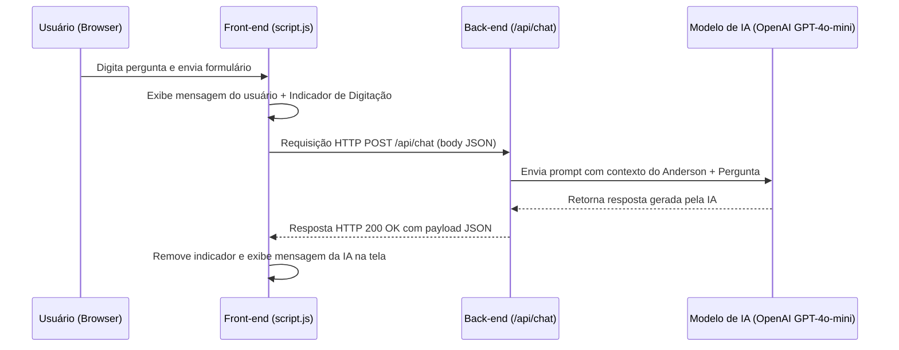

# 💻 Portfólio Profissional — Anderson Isidoro


> Portfólio web moderno, responsivo e interativo desenvolvido por **Anderson Isidoro**, Desenvolvedor Front-end em transição de carreira com mais de 17 anos de experiência na área de Segurança e Saúde do Trabalho (SST).

---

## 📌 Sumário
- [🎯 Propósito do Portfólio](#-propósito-do-portfólio)
- [🎨 Apresentação e Design](#-apresentação-e-design)
- [🛠️ Tecnologias Utilizadas](#️-tecnologias-utilizadas)
- [📁 Estrutura do Projeto](#-estrutura-do-projeto)
- [🚀 Projetos em Destaque](#-projetos-em-destaque)
- [⭐ Principais Funcionalidades](#-principais-funcionalidades)
- [🔍 Filtros e Modal Reutilizável de Projetos](#-filtros-e-modal-reutilizável-de-projetos)
- [♿ Responsividade e Acessibilidade](#-responsividade-e-acessibilidade)
- [🤖 Integração com "Anderson AI"](#-integração-com-anderson-ai)
- [🔌 Comunicação com o Back-end](#-comunicação-com-o-back-end)
- [💡 Ferramentas de Desenvolvimento com IA](#-ferramentas-de-desenvolvimento-com-ia)
- [🌐 Deploy & Hospedagem](#-deploy--hospedagem)
- [🌱 Aprendizados e Evolução](#-aprendizados-e-evolução)
- [💻 Como Executar o Projeto Localmente](#-como-executar-o-projeto-localmente)

---

## 🎯 Propósito do Portfólio

O objetivo principal deste portfólio é apresentar de forma clara, profissional e impactante a minha trajetória de transição de carreira para a área de desenvolvimento de software. 

Ele reúne meus principais projetos práticos — desde aplicações web focadas em JavaScript puro até ecossistemas SaaS em React, TypeScript, Supabase e Inteligência Artificial —, demonstrando minhas habilidades em arquitetura de código, usabilidade (UX/UI), consumo de APIs e resolução de problemas reais.

---

## 🎨 Apresentação e Design

A interface foi projetada seguindo as melhores práticas do design moderno de produtos digitais (*Dark Premium / Glassmorphism*):
- **Paleta de Cores Curada**: Fundo escuro profundo (`#0b0b0d` / `#141417`), texto de alto contraste (`#f3f4f6`) e acento vibrante em vermelho (`#ff5353`).
- **Animações Fluidas**: Animação de digitação dinâmica (*Typewriter effect*) no cabeçalho inicial, transições suaves em *hover* nos elementos e modais animados.
- **Hierarquia Visual Clara**: Divisão harmoniosa entre introdução (*Hero*), biografia (*Sobre Mim*), especialidades (*Serviços*), linha do tempo (*Resumo*), galeria de trabalhos (*Meus Projetos*) e canais de comunicação (*Contato*).

---

## 🛠️ Tecnologias Utilizadas

### **Tecnologias do Portfólio (Este Repositório)**
- **HTML5 Semântico**: Estruturação limpa com foco em SEO, semântica e acessibilidade.
- **CSS3 (Vanilla CSS)**: Estilização pura utilizando Custom Properties (variáveis), Flexbox, CSS Grid, Glassmorphism, animações `@keyframes` e suporte a `prefers-reduced-motion`.
- **JavaScript (ES6+)**: Manipulação nativa do DOM, lógica dinâmica de carregamento, consumo da API interna via `Fetch API` e gerenciamento de modais.
- **FontAwesome 6.3.0 & Google Fonts**: Tipografia com *Poppins* e *Berkshire Swash*, acompanhada de ícones vetoriais modernos.
- **Node.js & Vercel Serverless Functions**: Execução da rota `/api/chat` para integração segura com o assistente virtual.
- **OpenAI API (`gpt-4o-mini`)**: Modelo de linguagem embutido no assistente virtual **Anderson AI**.

### **Tecnologias dos Projetos Apresentados no Portfólio**
*Os projetos em destaque no acervo utilizam:*
- **React & TypeScript**: Aplicações com componentes tipados e escaláveis (*MedCare Connect*, *Kallos Barbearia*, *Dashboard SST*).
- **Supabase (PostgreSQL / RLS)**: Banco de dados relacional e autenticação segura (*MedCare Connect*, *Dashboard SST*).
- **TailwindCSS, Vite & Recharts**: Design systems responsivos e gráficos estatísticos em tempo real.
- **APIs Externas & LocalStorage**: Consumo de APIs REST externas (ex: OpenWeatherMap no projeto *Buscar Clima*) e persistência offline (LocalStorage no projeto *Lista de Tarefas*).

---

## 📁 Estrutura do Projeto

```text
portfolio-oficial/
├── api/
│   └── chat.js             # Vercel Serverless Function (integração segura com OpenAI)
├── imgs/                   # Imagens, capas de projetos e fotos de perfil
│   ├── anderson-frente.png
│   ├── anderson-direita.png
│   ├── logotipo_mc.png
│   ├── logotipo_tst.png
│   ├── kallos_icon.png
│   ├── busca_clima.png
│   └── lista_tarefas.png
├── index.html              # Estrutura principal do portfólio e modal dialog acessível
├── style.css               # Sistema de estilos globais, variáveis CSS e responsividade
├── script.js              # Lógica principal, dados de projetos, filtros e Anderson AI
├── package.json            # Configurações do projeto e dependências Node.js
├── .env.local              # Variáveis de ambiente locais (chaves de API)
└── README.md               # Documentação técnica e detalhada do projeto
```

---

## 🚀 Projetos em Destaque

| Projeto | Status | Tecnologias Principais | Links |
| :--- | :--- | :--- | :--- |
| **MedCare Connect** | 🟡 *Em andamento* | React, TypeScript, Vite, TailwindCSS, Supabase | [Deploy](https://medcare-connect.vercel.app/) \| [GitHub](https://github.com/aisidoro87/medcare-connect) |
| **Kallos Barbearia** | 🟡 *Em andamento* | React, TypeScript, Vite, CSS Modules | [Deploy](https://kallos-appointment-booker.vercel.app/) \| [GitHub](https://github.com/aisidoro87/kallos-appointment-booker) |
| **Dashboard SST** | 🟡 *Em andamento* | React, TypeScript, Supabase, Recharts, IA API | [Deploy](https://saudeocupacional-dashboard.vercel.app/) \| [GitHub](https://github.com/aisidoro87/saude-ocupacional) |
| **Buscar Clima & Tempo** | 🟢 *Concluído* | JavaScript (ES6+), HTML5, CSS3, OpenWeather API | [Deploy](https://buscar-clima-tempo.vercel.app/) \| [GitHub](https://github.com/aisidoro87/clima-tempo) |
| **Lista de Tarefas (To-Do List)** | 🟢 *Concluído* | JavaScript Vanilla, HTML5, CSS3, LocalStorage | [Deploy](https://tarefasemdia.vercel.app/) \| [GitHub](https://github.com/aisidoro87/Lista-de-tarefas) |

---

## ⭐ Principais Funcionalidades

1. **Efeito Typewriter no Hero**: Alternância dinâmica de títulos e papéis profissionais na tela inicial.
2. **Abas Interativas de Resumo**: Alternância simplificada entre históricos de **Experiências Profissionais** e **Formação Acadêmica**.
3. **Galeria de Projetos Dinâmica**: Renderização automatizada de cards a partir de uma estrutura de dados centralizada em JavaScript (`PORTFOLIO_PROJECTS`).
4. **Cards de Contato Centralizados**: Acesso direto a redes profissionais e canais de mensagem (LinkedIn, Instagram, GitHub e WhatsApp).
5. **Assistente Virtual Flutuante (Anderson AI)**: Chat interativo sempre disponível para tirar dúvidas de recrutadores e visitantes.

---

## 🔍 Filtros e Modal Reutilizável de Projetos

### **Filtros Dinâmicos por Status**
O portfólio conta com botões de filtragem em tempo real:
- **Todos**: Exibe o catálogo completo de soluções.
- **Em andamento**: Destaca os projetos em desenvolvimento ativo (*MedCare Connect*, *Kallos Barbearia*, *Dashboard Segurança do Trabalho*).
- **Concluídos**: Exibe as aplicações finalizadas (*Buscar Clima & Tempo*, *Lista de Tarefas*).

### **Modal Reutilizável de Detalhes Técnicos**
Ao clicar em qualquer card de projeto, um modal abre dinamicamente com navegação por abas:
- **👁️ Visão Geral**: Explicação detalhada sobre **O que é** o projeto, **Problema Resolvido** no mercado/cliente e lista com **Principais Funcionalidades**.
- **🧊 Arquitetura & Stacks**: Tabela descritiva contendo a **Stack Principal** (Front-end, Back-end, Banco de Dados, Deploy) e lista de **Decisões Técnicas & Boas Práticas**.
- **🔗 Ações Diretas**: Botões para abrir a aplicação live (*Deploy*) e visualizar o código-fonte no *GitHub*.

---

## ♿ Responsividade e Acessibilidade

- **Layout Mobile-First / Adaptativo**: Menus hambúrguer para telas menores e grades CSS adaptáveis (`repeat(auto-fill, minmax(330px, 1fr))`).
- **Navegação por Teclado**: Suporte completo ao foco (`:focus-visible`), acionamento de botões via tecla `Enter`/`Espaço` e fechamento do modal com a tecla `Escape`.
- **Atributos ARIA**: Utilização de `aria-label`, `aria-expanded`, `aria-hidden`, `aria-selected` e funções de `role="dialog"`.
- **Respeito às Preferências do Usuário**: Consulta `@media (prefers-reduced-motion: reduce)` para desativar animações pesadas para usuários sensíveis a movimento.

---

## 🤖 Integração com "Anderson AI"

### **O que é o Anderson AI?**
O **Anderson AI** é um assistente virtual flutuante integrado ao portfólio. Ele funciona como uma IA contextualizada com a trajetória profissional, formação e projetos do Anderson Isidoro, pronta para responder perguntas de visitantes, clientes e recrutadores 24 horas por dia.

### **Como Funciona?**
- O usuário clica no botão flutuante com o ícone de robô no canto inferior direito.
- A janela de conversa se abre com uma mensagem de boas-vindas digitada em tempo real.
- O usuário faz qualquer pergunta (ex: *"Qual é a experiência do Anderson em SST?"*, *"Quais tecnologias ele utilizou no MedCare Connect?"*).
- O assistente exibe um indicador visual de digitação (*typing indicator*) enquanto consulta a API e retorna a resposta formatada.

---

## 🔌 Comunicação com o Back-end

A arquitetura do **Anderson AI** utiliza uma camada serverless segura para evitar exposição de chaves de API no código cliente:



---

## 💡 Ferramentas de Desenvolvimento com IA

O desenvolvimento deste portfólio e dos projetos utiliza a Inteligência Artificial como uma **ferramenta de produtividade e amplificação técnica**:
- **ChatGPT & Antigravity (Gemini CLI)**: Prototipação rápida, arquitetura de componentes, elaboração de prompts de contexto e auxílio no debugging.
- **Lovable & v0**: Geração de ideias visuais e refinamento de layouts de interface.
- **GitHub Copilot**: Autocompletar código e aceleração na escrita de funções reutilizáveis.

> *Sempre buscando compreender, validar e aprimorar o código gerado, garantindo qualidade, segurança e conformidade com boas práticas.*

---

## 🌐 Deploy & Hospedagem

O projeto está hospedado e publicado na **Vercel**:
- **Deploy Contínuo**: Integração automática com o repositório GitHub (`main` branch).
- **Vercel Serverless Functions**: Execução da rota `/api/chat` em ambiente Serverless rápido e escalável.

---

## 🌱 Aprendizados e Evolução

- **Transição de Carreira Estruturada**: Integração de mais de 17 anos de bagagem analítica na área de Segurança do Trabalho com desenvolvimento web moderno.
- **Domínio de JavaScript Assíncrono**: Manipulação avançada do DOM, estado local e comunicação via requisições Fetch.
- **Arquitetura de UI Reutilizável**: Criação de modais dinâmicos e componentes modulares escaláveis.

---

## 💻 Como Executar o Projeto Localmente

### **Pré-requisitos**
- Node.js instalado no computador (versão 18 ou superior).
- Git instalado.

### **Passo a Passo**

1. **Clonar o repositório:**
   ```bash
   git clone https://github.com/aisidoro87/meu-portfolio.git
   cd meu-portfolio
   ```

2. **Instalar as dependências:**
   ```bash
   npm install
   ```

3. **Configurar as variáveis de ambiente:**
   Crie um arquivo `.env.local` na raiz do projeto contendo a sua chave da OpenAI:
   ```env
   OPENAI_API_KEY=sua_chave_api_aqui
   ```

4. **Executar a aplicação:**
   Para rodar com suporte às Serverless Functions da Vercel:
   ```bash
   npx vercel dev
   ```
   Ou, para visualizar apenas a interface do portfólio sem o funcionamento do Anderson AI, abra o arquivo `index.html` utilizando a extensão **Live Server** do VS Code.
eu 
5. **Acessar no navegador:**
   Abra `http://localhost:3000` (ou a URL indicada no terminal).

---

<p align="center">
  Desenvolvido com ☕ e dedicação por <strong>Anderson Isidoro</strong> — 2026
</p>
